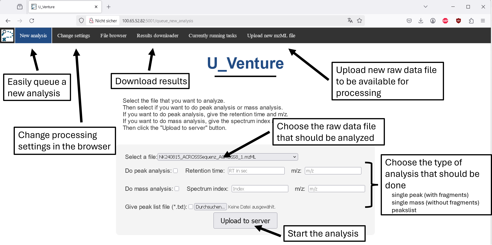

# UVenture

 **Analyze Full MS / AIF experiments and reconstruct quasi-isolated MS² spectra.**
 
This repository contains the code for a tool developed to process high-resolution Full MS and All-Ion Fragmentation (AIF) mass spectrometry data.  
The program allows researchers to reconstruct quasi-isolated MS² spectra from complex AIF datasets. By nature of the data-independent acquisition (DIA) that AIF is, more information are contained in the resulting measurement file compared to more traditional data-dependent acquisition (DDA) experiments.
In contrast to other programs, UVenture creates a local webserver that is reachable by all members of a team via a normal internet browser. The website provides a clean GUI for all interaction with the program.

Future versions with enhanced functionality and optimizations are planned and will be published in this repository.

### Features
-  Easy-to-use (simple user interface on a local website)
-  Flexible parameter settings for different instruments and experimental setups.
-  Identification of sum formulas of precursor ions and related fragment ions.
-  Reconstruction of quasi-isolated MS² spectra from Full MS / AIF data. 
-  Spectra, chromatograms and logfiles for every compound.
-  Export of a summary file for easy downstream analysis.

### Screenshots

| Isolated MS² spectrum of Acetylsalicylic acid as captured with a data-dependent Measurement | Reconstructed MS² spectrum of Acetylsalicylic acid as captured by a data-independent (AIF) measurement and processed with the tool |
|:------------------:|:--------------------------:|
|  |  |




Image of the Homepage as can be seen when accessing *IP:5000*. To start a new analysis, a *.mzML file must be uploaded to the server and can then be selected in the dropdown menu. Select the desired type of analysis and click "Upload to server".

---

## Installation
0. Make sure to have python installed on your system / on the server (tested with version: 3.12.0)
   
2. Clone or download & unzip the repository and then go (*cd*) to the new folder:
   ```bash
   cd path/of/the/new/folder # navigate to the newly downloaded folder
   
3. Create and activate a virtual environment
   ```bash
   # Create virtual environment (venv)
   python -m venv path/to/venv

   # Activate venv
   source path/to/venv/bin/activate # on Linux
   path\to\venv\Scripts\activate # on Windows

4. Install the required Python packages:
   ```bash
   pip install -r requirements.txt

5. Copy the formula cache to the appropriate location. This can either be done with the command line or via the desktop GUI. The destination folder where the formula cache should be saved can be checked and changed in the settings.
   

## Usage


To run the program:
1. Activate the venv.
2. Start the *UVenture_web.py* python script.
   
   ```bash
   source path/to/venv/bin/activate # Linux
   path\to\venv\Scripts\activate # Windows
   
   python UVenture_web.py

3. Open the browser and go to *IP:5000*. Where IP stands for the IP address of the PC/Server where the script is executed. E.g. *127.0.0.1:5000* or *192.168.178.2:5000*.
   This allows remote access to the program from PCs connected to the same local network as the server.

4. Remember to eventually update the provided formula cache (Formula Predictions) to support a larger m/z range. 

---

## Notes & Ideas for upcoming Versions
Future updates are planned to include:

- [ ] Add file converter to .mzML format (msconvert.exe).
- [x] Improve batch processing capabilities. Allow to schedule multiple tasks/analyses.
- [x] Bug fix: File browser
- [x] Add estimation for total runtime
- [ ] Check RAM usage and prevent from using over 90% of the RAM
- [x] Add API endpoints
- [ ] Automatic peak detection.
  - [x] Smoothing / Background subtraction of XIC
  - [x] Detection of peaks (RT, FWHM, exact mass, mass deviation)  
  - [ ] Detection of the type of ion. Either precursor ion or fragment ion.
  - [ ] Deconvoluion of overlapping peaks.
- [ ] Create a database search tool to handle large numbers of individual raw files.
  - [ ] Detect peaks with a given m/z in every raw file (create XIC). E.g. see if PFOA can be found in the samples.
  - [ ] Calculate sum formula and fragments of every peak for the given m/z value, for every raw file. Are it just isomers or completely different molecules.
  - [ ] Compare the different fragmentation patterns and see if similar patterns can be found across the raw data files in the database. Those might then be the same molecules, although the LC method might have been different.
  - [ ] Give a bar chart for every individual identified compound to directly compare the individual raw files.
- [ ] Create *local* user accounts to allow for settings to be saved per user
  - [ ] Allow user specific file uploads
  - [ ] Allocate x cores / RAM for one user
  - [ ] Allow user specific settings
  - [ ] Access controll for result files
- [ ] Allow for GC/EI-HRMS data analysis with fragment annotation and precursor ion identification.

## Contributing
Contributions and recommendations for upcoming versions are welcome!

## Citation
If you use this software for your research, please cite:
> **Niklas Karbach, Thorsten Hoffmann**, github.com/NKa1409/UVenture


## License
This project is licensed under the MIT License.
See the LICENSE file for more details.

## Contact
Niklas Karbach: n.karbach@uni-mainz.de
Thorsten Hoffmann: t.hoffmann@uni-mainz.de
